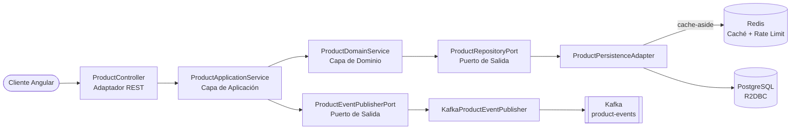

[](https://github.com/apchavez/spring-webflux-angular/actions/workflows/ci.yml)
[](https://sonarcloud.io/summary/new_code?id=apchavez_spring-webflux-angular)
[](https://sonarcloud.io/summary/new_code?id=apchavez_spring-webflux-angular)
[](https://sonarcloud.io/summary/new_code?id=apchavez_spring-webflux-angular)

# Spring WebFlux Angular Fullstack K8s

Monorepo fullstack con un backend reactivo en **Spring Boot WebFlux** siguiendo **Arquitectura Hexagonal** y un frontend en **Angular 21** con **Angular Material**. Orientado a eventos con **Apache Kafka**, desplegado en **Kubernetes**.

---

## Estructura

```
├── api/        Backend Spring Boot WebFlux (Java 21, Arquitectura Hexagonal) — ver api/README.md
│   └── k8s/    Manifiestos de Kubernetes (api + kafka + redis + servicios de soporte)
├── web/        Frontend Angular 21 (Angular Material, componentes standalone) — ver web/README.md
├── chart/      Chart de Helm — los manifiestos que realmente se despliegan (deploy.yml)
├── terraform/  Cluster EKS + VPC sobre el que despliega el chart anterior — ver terraform/README.md
├── postman/    Colección de Postman + entornos (local, k8s)
├── docker/     Script de inicialización de PostgreSQL, config de scrape de Prometheus, provisioning de Grafana
└── docker-compose.yml
```

Ver [`api/README.md`](api/README.md) para la configuración completa del backend, endpoints y detalles de testing, y [`web/README.md`](web/README.md) para el frontend.

---

## Stack Tecnológico

### Backend (`api/`)

| Categoría | Tecnología |
|---|---|
| Lenguaje / Runtime | Java 21, Spring Boot 3.5.3 |
| Reactividad | Spring WebFlux (Mono / Flux), Spring Data R2DBC |
| Base de datos | H2 (perfil dev) / PostgreSQL 16 (perfil prod) |
| Migraciones | Flyway (archivos SQL versionados en `db/migration/`, datos semilla de dev en `db/testdata/`) |
| Procesamiento batch | Spring Batch — importación masiva de CSV orientada a chunks, con salteo y continuación con reporte de error por fila |
| Caché | Redis (reactivo) — rate limiting + cache-aside para lecturas de productos (TTL de 5 min, fail-open) |
| Mensajería | Apache Kafka (KRaft, tópico `product-events`) |
| Seguridad | Spring Security + JWT RS256 (oauth2-resource-server), CORS, rate limiting |
| Observabilidad | Spring Boot Actuator, Micrometer + Prometheus, OpenTelemetry (OTLP), SLF4J + Logback (JSON ECS en prod), X-Request-Id |
| Documentación de API | Springdoc OpenAPI 2 (Swagger UI) |
| Build | Gradle 8, JaCoCo (≥ 80% en domain y application) |
| Calidad de código | ArchUnit, SonarCloud |
| Testing de integración | Testcontainers (PostgreSQL 16-alpine) |

### Frontend (`web/`)

| Categoría | Tecnología |
|---|---|
| Framework | Angular 21 (componentes standalone) |
| Librería de UI | Angular Material (tema M3) |
| HTTP | Angular HttpClient + RxJS |
| Formularios | Angular Reactive Forms |
| Tests | Vitest + Angular TestBed |
| Build | Angular CLI, Docker multi-stage (nginx) |

---

## Arquitectura (Backend)



```
api/src/main/java/com/apchavez/products
├── domain
│   ├── model          Product (record con invariantes)
│   ├── exception      Excepciones de dominio tipadas
│   ├── event          ProductEvent, ProductEventType
│   ├── port           ProductRepositoryPort, ProductEventPublisherPort (interfaces)
│   └── service        ProductDomainService (lógica de negocio pura)
├── application
│   └── ProductApplicationService  (orquestación, logging de auditoría, @Transactional)
└── infrastructure
    ├── config         Security, RateLimiting, RequestLogging, OpenApi, KafkaConfig, Startup
    ├── mapper         ProductMapper (DTO ↔ Dominio ↔ Entidad)
    ├── messaging      KafkaProductEventPublisher, NoOpProductEventPublisher
    ├── persistence    ProductEntity, ProductR2dbcRepository, ProductPersistenceAdapter
    └── web            ProductController, DTOs (Request/Update/Response), GlobalExceptionHandler
```

**Regla de dependencia:** `infrastructure` → `application` → `domain`
El dominio no tiene conocimiento de las capas externas. Verificado automáticamente por `ArchitectureTest` (ArchUnit).

---

## Cómo Empezar

### Levantar todo con Docker Compose

```bash
docker compose up --build
```

- **API:** `http://localhost:8080` / Swagger UI: `http://localhost:8080/swagger-ui.html`
- **Web:** `http://localhost:4200`
- **Prometheus:** `http://localhost:9090`
- **Grafana:** `http://localhost:3000` (acceso anónimo de solo lectura, con el dashboard de Product Service pre-provisionado)

### Solo backend (H2 en memoria)

```bash
cd api
./gradlew bootRun
```

### Solo frontend

```bash
cd web
npm install
npm start
```

---

## Colección de Postman

Importar `postman/spring-webflux-angular.postman_collection.json` en Postman.

Se incluyen dos entornos:
- `postman/spring-webflux-angular.local.postman_environment.json` — `http://localhost:8080`
- `postman/spring-webflux-angular.k8s.postman_environment.json` — `http://product-service.local`

La colección cubre todos los endpoints CRUD, casos de error de validación, y una carpeta de **Observabilidad** con requests a `/actuator/health/liveness`, `/actuator/health/readiness`, y `/actuator/prometheus`.

---

## Endpoints de la API

Path base: `/api/v1/products`

| Método | Ruta | Descripción | Respuestas |
|---|---|---|---|
| `POST` | `/api/v1/auth/login` | Login — credenciales demo `admin`/`admin123` (ADMIN) o `user`/`user123` (USER). Devuelve un JWT | `200`, `400`, `401` |
| `POST` | `/` | Crear producto | `201`, `400`, `409`, `422` |
| `GET` | `/active?page=0&size=20` | Listar productos activos (paginado, cacheado) | `200` |
| `GET` | `/inactive?page=0&size=20` | Listar productos inactivos/desactivados (paginado, sin caché — vista de admin de bajo tráfico) | `200` |
| `GET` | `/search?prefix=&page=0&size=20` | Buscar por prefijo de nombre (sin distinguir mayúsculas/minúsculas, paginado) | `200` |
| `GET` | `/sku/{sku}` | Buscar por SKU | `200`, `404` |
| `GET` | `/{id}` | Buscar por ID | `200`, `404` |
| `PUT` | `/{id}` | Actualización completa | `200`, `400`, `404`, `422` |
| `DELETE` | `/{id}` | Eliminar producto | `204`, `404` |
| `POST` | `/import` | Crear productos en masa desde un archivo CSV (`multipart/form-data`) — asíncrono, retorna de inmediato | `202`, `400` |
| `GET` | `/import/{jobExecutionId}` | Consultar estado del job de importación, conteos y errores por fila | `200`, `404` |
| `GET` | `/report/pdf` | Descargar reporte PDF con el listado completo de productos y totales (cantidad, valor de inventario) | `200` |
| `GET` | `/report/excel` | Descargar reporte Excel (XLSX) con el listado completo de productos y totales | `200` |

La importación masiva (solo `ROLE_ADMIN`, igual que los demás endpoints de escritura) corre como un job de Spring Batch en un thread pool dedicado — el upload retorna un `jobExecutionId` de inmediato en lugar de bloquear durante todo el archivo, y las filas con errores (errores de parseo, datos inválidos, SKUs duplicados) se saltan individualmente en vez de fallar toda la importación; consultar `/import/{jobExecutionId}` para el estado `COMPLETED`/`FAILED` más un reporte de errores por fila.

Los reportes (`/report/pdf` con Apache PDFBox, `/report/excel` con Apache POI `SXSSFWorkbook` streaming) requieren cualquier usuario autenticado, igual que los demás endpoints de lectura — no son exclusivos de `ROLE_ADMIN`. La generación es bloqueante por naturaleza de las librerías, así que corre en `Schedulers.boundedElastic()` para no bloquear el event loop reactivo.

---

## OpenAPI

La documentación se genera automáticamente con **Springdoc OpenAPI 2** a partir de las anotaciones `@Operation`, `@ApiResponse`, y `@Schema` en `ProductController`.

| Endpoint | URL | Notas |
|---|---|---|
| Swagger UI | `http://localhost:8080/swagger-ui.html` | Público — no requiere token para verse |
| Spec de OpenAPI (JSON) | `http://localhost:8080/v3/api-docs` | Público |

**Para probar endpoints autenticados desde el Swagger UI:**

1. Generar un token — inyectar `JwtService` y llamar a `generateToken("user", "ADMIN")` (o usar la colección de Postman, que setea `{{adminToken}}` automáticamente).
2. Hacer clic en **Authorize** en el Swagger UI e ingresar `Bearer <token>`.

Los endpoints de escritura (`POST`, `PUT`, `DELETE`) requieren `ROLE_ADMIN`. Los endpoints de lectura requieren cualquier usuario autenticado.

---

## Testing

### Backend
```bash
cd api && ./gradlew test
```

| Tipo | Clase | Descripción |
|---|---|---|
| Modelo de dominio — unitario + basado en propiedades (jqwik) | `ProductDomainTest` | Invariantes del record `Product` |
| Serialización JSON — basado en propiedades | `ProductResponseDTOSerializationTest` | Ida y vuelta sin pérdida de datos |
| Servicio de dominio — unitario | `ProductDomainServiceTest` | Lógica de negocio (crear/buscar/actualizar/eliminar) |
| Servicio de aplicación — unitario | `ProductApplicationServiceTest` | Orquestación de casos de uso + publicación de eventos |
| Adaptador de persistencia — `@SpringBootTest` + Testcontainers | `ProductPersistenceAdapterTest` | Puerto de persistencia con PostgreSQL 16 y Redis reales (comprueba que el caché realmente se lee/invalida, no es decorativo) |
| Publicador de Kafka — unitario | `KafkaProductEventPublisherTest` | Envío de JSON, resiliencia ante fallas de Kafka, error de serialización |
| Controlador REST — integración completa | `ProductControllerIntegrationTest` | Todos los endpoints y códigos de respuesta, incluyendo el 409 por SKU duplicado y las búsquedas por sku |
| Rate limiter — unitario | `RateLimitingFilterTest` | Límite por IP y aislamiento entre IPs |
| Probes de Actuator | `ActuatorHealthTest` | Liveness/Readiness |
| Arquitectura hexagonal — ArchUnit | `ArchitectureTest` | 4 reglas de dependencia forzadas |
| Job de importación batch — `@SpringBatchTest` + Testcontainers | `ProductImportJobIntegrationTest` | Corrida completa CSV → BD: filas válidas creadas, filas mal formadas/duplicadas salteadas y reportadas |
| Endpoints de importación batch — integración completa | `ProductImportControllerIntegrationTest` | Upload multipart, polling asíncrono de estado, reporte de errores, autenticación |
| Parseo/mapeo de CSV batch — unitario | `ProductCsvFieldSetMapperTest`, `ProductImportItemProcessorTest`, `ProductImportItemWriterTest` | Parseo estricto de campos, mapeo a dominio, reutilización de `ProductApplicationService` por fila |

### Frontend
```bash
# Tests unitarios
cd web && npm run test:coverage

# Tests E2E (Playwright)
cd web && npm run test:e2e
```

| Tipo | Clase | Descripción |
|---|---|---|
| Unitario de componente | `AppSpec` | Creación del app raíz y título |
| Unitario de servicio | `ProductServiceSpec` | Llamadas de HttpClient, mapeo de request/response |
| Unitario de componente | `ProductListComponentSpec` | Renderizado de tabla, estado de carga |
| Unitario de componente | `ProductFormComponentSpec` | Validación de formulario, modos crear/editar |
| E2E | `products.spec.ts` | Flujos CRUD, errores de validación — API mockeada con `page.route()` |

---

## Migraciones de Base de Datos (Flyway)

El esquema se gestiona con **Flyway** — archivos SQL versionados en `api/src/main/resources/db/migration/` que corren automáticamente al iniciar.

```
db/
├── migration/           Se aplica en todos los entornos (dev, prod, test)
│   ├── V1__create_product_table.sql
│   └── V2__add_created_at_to_product.sql
└── testdata/            Se aplica solo en dev (datos semilla)
    └── R__seed_products.sql
```

| Migración | Descripción |
|---|---|
| `V1__create_product_table.sql` | Crea la tabla `product` con constraints e índice |
| `V2__add_created_at_to_product.sql` | Agrega la columna timestamp `created_at` (evolución de esquema) |
| `R__seed_products.sql` | Repetible — inserta 3 productos de ejemplo (solo dev) |

Flyway usa un `DataSource` JDBC (HikariCP) que corre junto a la conexión reactiva R2DBC — un patrón común para la gestión de esquemas en aplicaciones WebFlux. La tabla `flyway_schema_history` registra las migraciones aplicadas.

---

## CI/CD

| Workflow / Job | Disparador | Qué hace |
|---|---|---|
| `ci.yml` / `test-api` | Cada push / PR | Compila, testea, JaCoCo ≥ 80%, SonarCloud (en main) |
| `ci.yml` / `test-web` | Cada push / PR | Tests de Angular + build de producción |
| `ci.yml` / `e2e-web` | Cada push / PR | Tests E2E de Playwright (API mockeada, Chromium) |
| `ci.yml` / `k8s-validate` | Cada push / PR | `helm lint` + `helm template` enviado a kubeconform — valida el chart real que se despliega |
| `ci.yml` / `terraform-validate` | Cada push / PR | `terraform fmt -check` + `terraform validate` sobre `terraform/` (no requiere credenciales de nube) |
| `ci.yml` / `docker-api` | Push a `main` | Construye y publica `ghcr.io/apchavez/spring-webflux-angular-api:latest` y `:sha-<SHA>` |
| `ci.yml` / `docker-web` | Push a `main` | Construye y publica `ghcr.io/apchavez/spring-webflux-angular-web:latest` y `:sha-<SHA>` |
| `deploy.yml` | Manual (`workflow_dispatch`) | `helm upgrade --install product-service ./chart --set api.image.tag=latest` → verifica el rollout |
| `destroy.yml` | Manual (`workflow_dispatch`) | Elimina el namespace `product-service` y todos sus recursos |

### Flujo de despliegue

`deploy.yml` es solo manual — no hay un cluster vivo detrás de este proyecto de portafolio, así que dispararlo automáticamente en cada push a `main` solo fallaría por falta de `KUBECONFIG`/secrets. Desplegar explícitamente cuando haya un cluster real al cual apuntar:

```bash
gh workflow run deploy.yml
```

**Secrets requeridos** (configurados en el entorno `production` de GitHub): `KUBECONFIG` (contenido del archivo kubeconfig), `DB_USER`, `DB_PASSWORD`, `KAFKA_USER`, `KAFKA_PASSWORD`, `REDIS_PASSWORD`.

---

## Kubernetes

Asume un cluster con `ingress-nginx` y una `StorageClass` por defecto respaldada por EBS ya existentes. No se provisiona ningún cluster por defecto — ver [`terraform/README.md`](terraform/README.md) para levantar uno en EKS (nota: esto crea recursos reales de AWS, con costo).

Los manifiestos que realmente se despliegan viven en `chart/` (Helm) — esto es lo que aplica `deploy.yml` vía `helm upgrade --install`:

| Archivo | Descripción |
|---|---|
| `namespace.yaml` | Namespace `product-service` |
| `configmap.yaml` | Configuración no sensible (perfil, host de BD, bootstrap de Kafka, `OTEL_EXPORTER_OTLP_ENDPOINT`) |
| `secret.yaml` | Credenciales de base de datos, Kafka y Redis |
| `deployment.yaml` | 2 réplicas, imagen de ghcr.io, probes, límites de recursos, securityContext |
| `service.yaml` | ClusterIP en el puerto 80 |
| `ingress.yaml` | Ingress de NGINX en `product-service.local` |
| `postgres.yaml` | Deployment de PostgreSQL + PVC de 1Gi |
| `kafka.yaml` | Kafka de un solo nodo (Bitnami KRaft, sin Zookeeper) + PVC de 2Gi — los datos del tópico sobreviven reinicios de pod |
| `redis.yaml` | Deployment de Redis — contadores de rate limiting + cache-aside de productos (fail-open) |
| `prometheus-rule.yaml` | CRD PrometheusRule con reglas de alertas (requiere Prometheus Operator) |
| `grafana.yaml` | Deployment de Grafana con datasource de Prometheus y dashboard pre-provisionados |
| `hpa.yaml` | HorizontalPodAutoscaler — 2–10 réplicas, escala por CPU (70%) y memoria (80%) |
| `network-policy.yaml` | NetworkPolicy — restringe ingress (solo nginx + grafana) y egress (postgres, redis, kafka, OTLP, DNS) |

---

## Observabilidad

La API expone métricas en `/actuator/prometheus` (registro Micrometer + Prometheus) y trazas distribuidas vía OpenTelemetry (exportador OTLP, configurable con `OTEL_EXPORTER_OTLP_ENDPOINT`). Todas las requests se registran con un header de correlación `X-Request-Id`.

> **Nota de diseño:** `/actuator/prometheus` y `/swagger-ui.html`/`/v3/api-docs` son intencionalmente `permitAll()` (`SecurityConfig.java`) y accesibles a través del Ingress público — la carpeta "Observabilidad" de la colección de Postman ejercita `/actuator/prometheus` directamente contra el entorno k8s como parte de la demo. Ninguno filtra datos de la aplicación: la superficie de actuator es solo de métricas (no expone `env`/`heapdump`/etc. — ver `application.yml`), y Swagger solo expone la *forma* de la API, ya que toda llamada a `/api/v1/**` sigue requiriendo un JWT válido (y rol `ADMIN` para escrituras) sin importar cómo se invoque. Es una decisión deliberada de portafolio — docs/métricas públicas para mostrar la API, no un descuido.

### Logging estructurado en JSON

En el perfil `prod`, los logs se emiten como JSON en **Elastic Common Schema (ECS)** hacia stdout — listos para ser ingeridos por Loki, Elasticsearch, o cualquier agregador de logs.

```json
{
  "@timestamp": "2024-06-30T10:15:30.123Z",
  "log.level": "INFO",
  "message": "HTTP request completed",
  "service.name": "product-service",
  "trace.id": "4bf92f3577b34da6a3ce929d0e0e4736",
  "span.id": "00f067aa0ba902b7",
  "requestId": "A3F7B2C1",
  "http.method": "POST",
  "url.path": "/api/v1/products",
  "http.response.status_code": 201,
  "event.duration_ms": 42
}
```

`trace.id` y `span.id` se inyectan automáticamente por Micrometer Tracing / OpenTelemetry. `requestId` lo emite `RequestLoggingFilter` como un par clave-valor estructurado vía la API fluida de SLF4J 2.x. En el perfil `dev` se usa el formato de consola legible por humanos por defecto.

`chart/templates/prometheus-rule.yaml` contiene un CRD `PrometheusRule` (Prometheus Operator) con tres reglas de alerta:

| Alerta | Severidad | Condición |
|---|---|---|
| `HighErrorRate` | critical | > 5% de las requests retornan 5xx durante 2 min |
| `HighP99Latency` | warning | Latencia P99 > 1 s durante 2 min |
| `PodNotReady` | critical | Algún pod no está ready durante 2 min |

Requiere [Prometheus Operator](https://github.com/prometheus-operator/prometheus-operator) instalado en el cluster.

`chart/templates/grafana.yaml` despliega Grafana con un datasource de Prometheus y un dashboard pre-provisionados, que cubre tasa de requests, tasa de error, latencia P50/P99, y paneles de memoria JVM.

```bash
kubectl port-forward svc/grafana 3000:3000 -n product-service
```

El mismo par Prometheus + Grafana también está disponible sin cluster vía `docker compose up --build` (ver [Cómo Empezar](#cómo-empezar)) — `docker/prometheus.yml` y `docker/grafana/` replican la config de scrape, datasource y dashboard del chart de Helm para iteración local.

---

## Seguridad

La API está protegida con tokens **JWT RS256**. Se usa un par de claves RSA 2048 local (almacenado en `api/src/main/resources/certs/`) para firmar y verificar tokens.

| Ruta | Método | Rol requerido |
|---|---|---|
| `/api/v1/**` | `GET` | Cualquier usuario autenticado (`USER` o `ADMIN`) |
| `/api/v1/**` | `POST`, `PUT`, `DELETE` | Solo `ROLE_ADMIN` |
| `/actuator/**`, `/swagger-ui/**`, `/v3/api-docs/**` | Cualquiera | Público (no requiere token) |

La generación de tokens la maneja `JwtService` (disponible en el contexto de Spring). Para pruebas locales, generar un token con:

```java
// inyectar JwtService y llamar:
String adminToken = jwtService.generateToken("alice", "ADMIN");
String userToken  = jwtService.generateToken("bob",   "USER");
```

Pasar el token en el header `Authorization`:
```
Authorization: Bearer <token>
```

La colección de Postman usa una variable de entorno `{{adminToken}}` — configurarla en el entorno activo antes de correr requests de escritura.

---

## Qué Demuestra Este Proyecto

- Monorepo fullstack: backend reactivo en Java + SPA de Angular compartiendo el mismo repo y pipeline de CI
- Programación reactiva de punta a punta: controladores WebFlux → repositorio R2DBC → PostgreSQL (sin I/O bloqueante)
- Cache-aside con Redis para lecturas de productos (TTL de 5 min, invalidado en escrituras, falla abierto si Redis no está disponible) — compartido entre réplicas, a diferencia de un caché en memoria por instancia
- Arquitectura hexagonal con tests de ArchUnit que fuerzan las reglas de dependencia en tiempo de build
- Puerto de salida orientado a eventos: Kafka publica `product-events` en cada creación/actualización/eliminación
- Importación masiva con Spring Batch: procesamiento de CSV orientado a chunks en un thread pool dedicado (aislado del camino de requests reactivo), parseo estricto de campos a medida, tolerancia a fallas con salteo y continuación con reporte de error por fila, reutilizando la misma validación de dominio/deduplicación/publicación de eventos que el endpoint de creación individual en vez de saltárselas
- Componentes standalone de Angular 21 con Angular Material (M3), HttpClient, y Reactive Forms
- Cobertura de tests exhaustiva: unitarios, de integración (Testcontainers + PostgreSQL real), basados en propiedades, arquitectónicos (backend) + Vitest y Playwright E2E (frontend)
- Manifiestos de Kubernetes listos para producción con health probes, límites de recursos, y security context
- Stack de observabilidad completo: métricas de Prometheus (`/actuator/prometheus`), trazas distribuidas con OpenTelemetry, alertas con PrometheusRule, y dashboard de Grafana provisionado vía ConfigMaps de K8s
- Infraestructura como código: Terraform provisiona el cluster EKS, la VPC, el driver CSI de EBS, e ingress-nginx sobre los que despliega el chart de Helm (ver [`terraform/README.md`](terraform/README.md))
- Builds de Docker multi-stage para ambos servicios + publicación automática a GHCR en cada merge a main

---

## Proyectos Relacionados

Este repo forma pareja con **spring-mvc-angular**, **quarkus-react**, y **net-vue**: los cuatro implementan el mismo dominio de Product Management (sku/name/description/category/price/stock/active), los mismos 8 endpoints REST (incluyendo listar y reactivar productos inactivos), el mismo tópico de Kafka `product-events` y las mismas reglas de rate limiting con Redis, con distinto stack de backend/frontend — mantenidos a propósito en paridad funcional. El trío serverless de clinic-scheduling forma un segundo grupo así, compartiendo ese otro dominio.

| Proyecto | Descripción |
|---|---|
| [spring-mvc-angular](https://github.com/apchavez/spring-mvc-angular) | La contraparte bloqueante de este repo — mismo dominio y frontend en Angular, backend clásico en Spring MVC + Spring Data JDBC en vez de WebFlux + R2DBC reactivos |
| [quarkus-react](https://github.com/apchavez/quarkus-react) | Mismo dominio de Product Management que este repo, backend en Quarkus, frontend en React, MongoDB, Redis, eventos de Kafka, Kubernetes |
| [net-vue](https://github.com/apchavez/net-vue) | Mismo dominio de Product Management que este repo, backend en ASP.NET Core, frontend en Vue 3, PostgreSQL, Kafka, Kubernetes |
| [aws-typescript](https://github.com/apchavez/aws-typescript) | Plataforma de agendamiento de citas médicas — TypeScript, AWS Lambda, DynamoDB, SNS/SQS |
| [azure-python](https://github.com/apchavez/azure-python) | Mismo dominio de agendamiento de citas que el anterior, reescrito en Python sobre Azure Functions con Clean Architecture |
| [gcp-go](https://github.com/apchavez/gcp-go) | Mismo dominio de agendamiento de citas que el anterior, escrito en Go sobre GCP Cloud Run con Clean Architecture |
