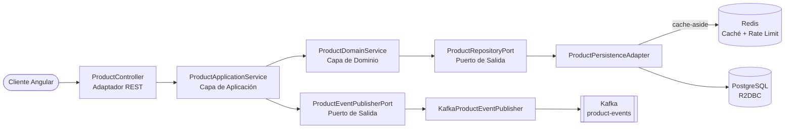

# Product Service — Backend Spring Boot

API REST reactiva para la plataforma Product Service, construida con **Spring Boot WebFlux** siguiendo **Arquitectura Hexagonal** (Puertos y Adaptadores). Provee operaciones CRUD para la gestión de productos, respaldada por PostgreSQL (R2DBC), con publicación de eventos vía Kafka, rate limiting con Redis, y autenticación JWT RS256.

---

## Stack Tecnológico

| Categoría | Tecnología |
|---|---|
| Lenguaje / Runtime | Java 21, Spring Boot 3.5.3 |
| Reactividad | Spring WebFlux (Mono / Flux), Spring Data R2DBC |
| Base de datos | H2 (perfil dev) / PostgreSQL 16 (perfil prod) |
| Migraciones | Flyway (versionadas en `db/migration/`, datos semilla de dev en `db/testdata/`) |
| Caché | Redis (reactivo) — rate limiting + cache-aside para lecturas de productos (TTL de 5 min, fail-open) |
| Mensajería | Apache Kafka (KRaft, tópico `product-events`) |
| Seguridad | Spring Security + JWT RS256 (oauth2-resource-server), CORS, rate limiting |
| Observabilidad | Spring Boot Actuator, Micrometer + Prometheus, OpenTelemetry (OTLP), SLF4J + Logback (JSON ECS en prod), X-Request-Id |
| Documentación de API | Springdoc OpenAPI 2 (Swagger UI) |
| Build | Gradle 8, JaCoCo (≥ 80% en domain y application) |
| Calidad de código | ArchUnit, SonarCloud |
| Testing de integración | Testcontainers (PostgreSQL 16-alpine) |

---

## Arquitectura



```
src/main/java/com/apchavez/products
├── domain
│   ├── model          Product (record con invariantes)
│   ├── exception      Excepciones de dominio tipadas
│   ├── event          ProductEvent, ProductEventType
│   ├── port           ProductRepositoryPort, ProductEventPublisherPort (interfaces)
│   └── service        ProductDomainService (lógica de negocio pura)
├── application
│   └── ProductApplicationService  (orquestación, logging de auditoría, @Transactional)
└── infrastructure
    ├── auth           DemoUserStore, InvalidCredentialsException
    ├── config         Security, RateLimiting, RequestLogging, OpenApi, KafkaConfig, Startup, JwtService
    ├── mapper         ProductMapper (DTO ↔ Dominio ↔ Entidad)
    ├── messaging      KafkaProductEventPublisher, NoOpProductEventPublisher
    ├── persistence    ProductEntity, ProductR2dbcRepository, ProductPersistenceAdapter
    └── web            ProductController, AuthController, DTOs (Request/Update/Response/Login), GlobalExceptionHandler
```

**Regla de dependencia:** `infrastructure` → `application` → `domain`
El dominio no tiene conocimiento de las capas externas. Verificado automáticamente por `ArchitectureTest` (ArchUnit).

---

## Prerrequisitos

- Java 21
- Docker Desktop (para PostgreSQL, Redis y Kafka — no se requiere para el perfil `dev`, que usa H2 en memoria)

---

## Correr Localmente

### Opción A — Docker Compose (stack completo, desde la raíz del repo)

```bash
docker compose up --build
```

API en `http://localhost:8080` · Swagger UI en `http://localhost:8080/swagger-ui.html`

### Opción B — Solo backend (H2 en memoria, hot-reload)

```bash
cd api
./gradlew bootRun
```

No requiere servicios externos — el perfil `dev` corre contra H2 con los datos semilla de `R__seed_products.sql`.

---

## Endpoints de la API

Path base: `/api/v1/products`

| Método | Ruta | Descripción | Respuestas |
|---|---|---|---|
| `POST` | `/api/v1/auth/login` | Login — devuelve un JWT. Público, no requiere token | `200`, `400`, `401` |
| `POST` | `/` | Crear producto | `201`, `400`, `409`, `422` |
| `GET` | `/active?page=0&size=20` | Listar productos activos (paginado) | `200` |
| `GET` | `/inactive?page=0&size=20` | Listar productos inactivos/desactivados (paginado) | `200` |
| `GET` | `/search?prefix=&page=0&size=20` | Buscar por prefijo de nombre (sin distinguir mayúsculas/minúsculas, paginado) | `200` |
| `GET` | `/sku/{sku}` | Buscar por SKU | `200`, `404` |
| `GET` | `/{id}` | Buscar por ID | `200`, `404` |
| `PUT` | `/{id}` | Actualización completa | `200`, `400`, `404`, `422` |
| `DELETE` | `/{id}` | Eliminar producto | `204`, `404` |
| `POST` | `/import` | Crear productos en masa desde un archivo CSV (`multipart/form-data`) — asíncrono vía Spring Batch, retorna de inmediato | `202`, `400` |
| `GET` | `/import/{jobExecutionId}` | Consultar estado del job de importación, conteos y errores por fila | `200`, `404` |
| `GET` | `/report/pdf` | Descargar reporte PDF con el listado completo de productos y totales | `200` |
| `GET` | `/report/excel` | Descargar reporte Excel (XLSX) con el listado completo de productos y totales | `200` |

---

## OpenAPI

La documentación se genera automáticamente con **Springdoc OpenAPI 2** a partir de las anotaciones `@Operation`, `@ApiResponse`, y `@Schema` en `ProductController`.

| Endpoint | URL | Notas |
|---|---|---|
| Swagger UI | `http://localhost:8080/swagger-ui.html` | Público — no requiere token para verse |
| Spec de OpenAPI (JSON) | `http://localhost:8080/v3/api-docs` | Público |

**Para probar endpoints autenticados desde el Swagger UI:**

1. Generar un token — inyectar `JwtService` y llamar a `generateToken("user", "ADMIN")` (o usar la colección de Postman, que setea `{{adminToken}}` automáticamente).
2. Hacer clic en **Authorize** en el Swagger UI e ingresar `Bearer <token>`.

Los endpoints de escritura (`POST`, `PUT`, `DELETE`) requieren `ROLE_ADMIN`. Los endpoints de lectura requieren cualquier usuario autenticado.

---

## Seguridad

La API está protegida con tokens **JWT RS256**. Un par de claves RSA 2048 local (almacenado en `src/main/resources/certs/`) firma y verifica los tokens.

### Login

```
POST /api/v1/auth/login
Content-Type: application/json

{ "username": "admin", "password": "admin123" }
```

Usuarios demo hardcodeados en `DemoUserStore` (no es un store real, es solo para este portafolio):

| Usuario | Contraseña | Roles |
|---|---|---|
| `admin` | `admin123` | `ADMIN`, `USER` |
| `user` | `user123` | `USER` |

Respuesta `200`:
```json
{ "token": "eyJ...", "tokenType": "Bearer", "expiresIn": 3600, "username": "admin", "roles": ["ADMIN", "USER"] }
```

`401` con credenciales inválidas. El frontend Angular (ver [`web/README.md`](../web/README.md)) consume este endpoint directamente y persiste el token en `localStorage`.

### Autorización

| Ruta | Método | Rol requerido |
|---|---|---|
| `/api/v1/auth/login` | `POST` | Público |
| `/api/v1/**` | `GET` | Cualquier usuario autenticado (`USER` o `ADMIN`) |
| `/api/v1/**` | `POST`, `PUT`, `DELETE` | Solo `ROLE_ADMIN` |
| `/actuator/**`, `/swagger-ui/**`, `/v3/api-docs/**` | Cualquiera | Público (no requiere token) |

La generación de tokens la maneja `JwtService` (disponible en el contexto de Spring) — ahora expuesta vía el endpoint de login de arriba. Para tests/uso directo desde código Java también se puede seguir generando en memoria:

```java
// inyectar JwtService y llamar:
String adminToken = jwtService.generateToken("alice", "ADMIN");
String userToken  = jwtService.generateToken("bob",   "USER");
```

Pasar el token en el header `Authorization`:
```
Authorization: Bearer <token>
```

La colección de Postman incluye un request de **Login** que captura el token en la variable de colección `{{adminToken}}` automáticamente vía un test script — correrlo primero antes de los requests de escritura.

### CORS (solo relevante si el frontend no pasa por el mismo origen)

`docker-compose.yml` sirve el frontend a través de un proxy nginx (`web/nginx.conf`, ruta `/api/`) hacia este backend, así que en el stack completo el navegador nunca hace una petición cross-origin real. Aun así, Spring registra un `CorsConfigurationSource` para `/**` incondicionalmente — con la lista de orígenes permitidos vacía, **cualquier request que traiga un header `Origin`** (todo navegador real en un POST, incluso mismo origen) es rechazada con `403` sin body, aunque `curl` sin ese header funcione perfecto. Por eso `docker-compose.yml` fija `SECURITY_CORS_ALLOWED_ORIGINS=http://localhost:4200` en el servicio `api` — sin esa variable, el login nunca funciona desde un navegador real aunque funcione por `curl`.

---

## Migraciones de Base de Datos (Flyway)

El esquema se gestiona con **Flyway** — archivos SQL versionados en `src/main/resources/db/migration/` que corren automáticamente al iniciar.

```
db/
├── migration/           Se aplica en todos los entornos (dev, prod, test)
│   ├── V1__create_product_table.sql
│   └── V2__add_created_at_to_product.sql
└── testdata/            Se aplica solo en dev (datos semilla)
    └── R__seed_products.sql
```

| Migración | Descripción |
|---|---|
| `V1__create_product_table.sql` | Crea la tabla `product` con constraints e índice |
| `V2__add_created_at_to_product.sql` | Agrega la columna timestamp `created_at` (evolución de esquema) |
| `R__seed_products.sql` | Repetible — inserta 3 productos de ejemplo (solo dev) |

Flyway usa un `DataSource` JDBC (HikariCP) que corre junto a la conexión reactiva R2DBC — un patrón común para la gestión de esquemas en aplicaciones WebFlux. La tabla `flyway_schema_history` registra las migraciones aplicadas.

---

## Caché

`ProductPersistenceAdapter` implementa lecturas cache-aside sobre Redis (`ReactiveStringRedisTemplate`, JSON vía Jackson):

| Clave de caché | Poblada por | TTL |
|---|---|---|
| `product-cache:{id}` | `findById` | 5 min |
| `product-sku-cache:{sku}` | `findBySku` | 5 min |
| `products-active-cache:{page}:{size}` | `findAllActive` | 5 min |

Ambas se invalidan (`KEYS` + `DEL` sobre su prefijo) en cada `save`/`update`/`delete`. Es un caché distribuido real, no decorativo — con 2 réplicas (`deployment.yaml`), se comparte entre pods en vez de que cada instancia mantenga su propia copia desactualizada.

**Fail-open:** cualquier error de Redis (lectura, escritura, o invalidación) se registra como warning y se trata como un cache miss/no-op — `ProductPersistenceAdapter` siempre cae de vuelta a PostgreSQL. Redis no forma parte del readiness probe de Actuator; si está caído, el pod se mantiene `Ready` y sigue sirviendo desde Postgres, solo que sin la aceleración del caché.

---

## Testing

```bash
./gradlew test
```

| Tipo | Clase | Descripción |
|---|---|---|
| Modelo de dominio — unitario + basado en propiedades (jqwik) | `ProductDomainTest` | Invariantes del record `Product` |
| Serialización JSON — basado en propiedades | `ProductResponseDTOSerializationTest` | Ida y vuelta sin pérdida de datos |
| Servicio de dominio — unitario | `ProductDomainServiceTest` | Lógica de negocio (crear/buscar/actualizar/eliminar) |
| Servicio de aplicación — unitario | `ProductApplicationServiceTest` | Orquestación de casos de uso + publicación de eventos |
| Adaptador de persistencia — `@SpringBootTest` + Testcontainers | `ProductPersistenceAdapterTest` | Puerto de persistencia con PostgreSQL 16 y Redis reales (comprueba que el caché realmente se lee/invalida, no es decorativo) |
| Publicador de Kafka — unitario | `KafkaProductEventPublisherTest` | Envío de JSON, resiliencia ante fallas de Kafka, error de serialización |
| Controlador REST — integración completa | `ProductControllerIntegrationTest` | Todos los endpoints y códigos de respuesta, incluyendo el 409 por SKU duplicado y las búsquedas por sku |
| Store de usuarios demo — unitario | `DemoUserStoreTest` | Autenticación correcta/incorrecta por usuario/contraseña |
| Login — integración completa | `AuthControllerIntegrationTest` | 200 con token válido, 401 en credenciales inválidas, 400 en campos vacíos, y prueba real de que el token emitido efectivamente autoriza un endpoint protegido |
| Rate limiter — unitario | `RateLimitingFilterTest` | Límite por IP y aislamiento entre IPs |
| Probes de Actuator | `ActuatorHealthTest` | Liveness/Readiness |
| Arquitectura hexagonal — ArchUnit | `ArchitectureTest` | 4 reglas de dependencia forzadas |

Los tests de integración con Testcontainers requieren Docker. La cobertura está condicionada por JaCoCo a ≥ 80% en las capas de dominio y aplicación.

---

## Observabilidad

La API expone métricas en `/actuator/prometheus` (registro Micrometer + Prometheus) y trazas distribuidas vía OpenTelemetry (exportador OTLP, configurable con `OTEL_EXPORTER_OTLP_ENDPOINT`). Todas las requests se registran con un header de correlación `X-Request-Id`.

> **Nota de diseño:** `/actuator/prometheus` y `/swagger-ui.html`/`/v3/api-docs` son intencionalmente `permitAll()` (`SecurityConfig.java`) y accesibles a través del Ingress público — la carpeta "Observabilidad" de la colección de Postman ejercita `/actuator/prometheus` directamente contra el entorno k8s como parte de la demo. Ninguno filtra datos de la aplicación: la superficie de actuator es solo de métricas (no expone `env`/`heapdump`/etc.), y Swagger solo expone la *forma* de la API, ya que toda llamada a `/api/v1/**` sigue requiriendo un JWT válido. Es una decisión deliberada de portafolio — docs/métricas públicas para mostrar la API, no un descuido.

### Logging estructurado en JSON

En el perfil `prod`, los logs se emiten como JSON en **Elastic Common Schema (ECS)** hacia stdout, listos para ser ingeridos por Loki, Elasticsearch, o cualquier agregador de logs. `trace.id`/`span.id` se inyectan por Micrometer Tracing / OpenTelemetry; `requestId` lo emite `RequestLoggingFilter`. En el perfil `dev` se usa el formato de consola legible por humanos por defecto.

### Alertas

`chart/templates/prometheus-rule.yaml` define un `PrometheusRule` (requiere [Prometheus Operator](https://github.com/prometheus-operator/prometheus-operator)) con tres reglas: `HighErrorRate` (critical, >5% de 5xx durante 2 min), `HighP99Latency` (warning, P99 >1s durante 2 min), `PodNotReady` (critical, algún pod no ready durante 2 min).

---

## Kubernetes

Los manifiestos que realmente se despliegan viven en `chart/` (Helm) en la raíz del repo — esto es lo que aplica `deploy.yml` vía `helm upgrade --install`.

| Archivo | Descripción |
|---|---|
| `configmap.yaml` | Configuración no sensible (perfil, host de BD, bootstrap de Kafka, `OTEL_EXPORTER_OTLP_ENDPOINT`) |
| `secret.yaml` | Credenciales de base de datos, Kafka y Redis |
| `deployment.yaml` | 2 réplicas, imagen de ghcr.io, probes, límites de recursos, securityContext |
| `postgres.yaml` | Deployment de PostgreSQL + PVC de 1Gi |
| `kafka.yaml` | Kafka de un solo nodo (Bitnami KRaft, sin Zookeeper) + PVC de 2Gi |
| `redis.yaml` | Deployment de Redis — contadores de rate limiting + cache-aside de productos (fail-open) |
| `hpa.yaml` | HorizontalPodAutoscaler — 2–10 réplicas, escala por CPU (70%) y memoria (80%) |
| `network-policy.yaml` | Restringe ingress (solo nginx + grafana) y egress (postgres, redis, kafka, OTLP, DNS) |

Ver el [README raíz](../README.md#kubernetes) para la tabla completa de manifiestos e instrucciones de despliegue.

---

## CI/CD

| Job (`ci.yml`) | Disparador | Qué hace |
|---|---|---|
| `test-api` | Cada push / PR | Compila, testea, JaCoCo ≥ 80%, SonarCloud (en main) |
| `k8s-validate` | Cada push / PR | `helm lint` + `helm template` enviado a kubeconform |
| `docker-api` | Push a `main` | Construye y publica `ghcr.io/apchavez/spring-webflux-angular-api:latest` y `:sha-<SHA>` |

Ver el [README raíz](../README.md#cicd) para la tabla completa de workflows, incluyendo los jobs del frontend y el deploy manual.

---

## Relacionado

- [`../README.md`](../README.md) — descripción general del proyecto, deploy a Kubernetes, tabla completa de CI/CD
- [`../web/README.md`](../web/README.md) — frontend en Angular
